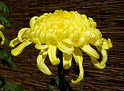

# Chrysanthemum

*From Wikipedia, the free encyclopedia.*

**Chrysanthemums**, often called 'mums', are a [genus](glossaryGenus.md) \(**Chrysanthemum**\) of about 30 species of [perennial](glossaryPerennial.md) flowering plants in the family Asteraceae, native to Asia and northeastern Europe.

The genus once included many more species, but was split several decades ago into several genera; the naming of the genera has been contentious, but a ruling of the International Code of Botanical Nomenclature in 1999 resulted in the defining species of the genus being changed to **Chrysanthemum indicum**, thereby restoring the economically important florist's chrysanthemum to the genus **Chrysanthemum**. These species were, after the splitting of the genus but before the ICBN ruling, commonly treated under the genus name **Dendranthema**.

**Chrysanthemums** were cultivated in China as a flowering herb as far back as the 15th century BC. An ancient Chinese city was named Ju-Xian, meaning "*chrysanthemum city*". The plant is particularly significant during the Double Ninth Festival. The flower was introduced into Japan probably in the 8th century AD, and the Emperor adopted the flower as his official seal. There is a "*Festival of Happiness*" in Japan that celebrates the flower.

The flower was brought to Europe in the 17th century. Linnaeus named it from the Greek word *chrysous*, golden \(the colour of the original flowers\), and -*anthemon*, meaning flower.

**Chrysanthemums** are broken into two basic groups, Garden Hardy and Exhibition. Garden hardy mums are perennials capable of being wintered over in the ground in most northern latitudes. Exhibition varieties are not usually as sturdy. Garden hardies are defined by their ability to produce an abundance of small blooms with little if any mechanical assistance \(ie. staking\) and withstanding wind and rain. Exhibition varieties on the other hand require staking, over-wintering in a relatively dry cool environment, sometimes with the addition of night lights.

**Related information**  

[Salvia](salvia.md#)

