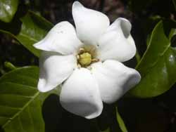

# Gardenia

*From Wikipedia, the free encyclopedia.*

**Gardenia** is a [genus](glossaryGenus.md) of about 250 species of flowering plants in the coffee family, **Rubiaceae**, native to the tropical and subtropical regions of Africa, southern Asia, Australasia and Oceania. Several species occur on Hawaii, where gardenias are known as *na'u* or *nanu*.

The genus was named by Carl Linnaeus after Dr. Alexander Garden \(1730-1791\), a Scottish-born American naturalist.

They are evergreen shrubs and small trees growing to 1–15 metres \(3.3–49 ft\) tall. The leaves are opposite or in whorls of three or four, 5–50 centimetres \(2.0–20 in\) long and 3–25 centimetres \(1.2–9.8 in\) broad, dark green and glossy with a leathery texture. The flowers are solitary or in small clusters, white, or pale yellow, with a tubular-based corolla with 5-12 lobes \(petals\) from 5–12 centimetres \(2.0–4.7 in\) diameter. Flowering is from about mid-spring to mid-summer and many species are strongly scented.

**Gardenia** plants are prized for the strong sweet scent of their flowers, which can be very large in some species.

**Gardenias** have a reputation for being difficult to grow. Because they originated in warm humid tropical areas, they demand high humidity to thrive. They flourish in acidic soils with good drainage and thrive on \[68-74 F temperatures \(20-23 C\)\] during the day and 60 F \(15-16 C\) in the evening. Potting soils developed especially for gardenias are available.

In Japan and China, **Gardenia jasminoides** is called *Kuchinashi* \(Japanese\) and *Zhi zi* \(Chinese\); the bloom is used as a yellow dye, which is used for clothes and food \(including the Korean mung bean jelly called hwangpomuk\).

**Related information**  

[Lilac](lilac.md#)

