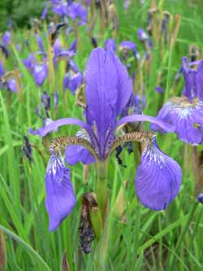

# Iris

*From Wikipedia, the free encyclopedia.*

**Iris** is a [genus](glossaryGenus.md) of between 200-300 species of flowering plants with showy flowers. It takes its name from the Greek word for a *rainbow*, referring to the wide variety of flower colors found among the many species. As well as being the scientific name, iris is also very widely used as a common name; for one thing, it refers to all **Iris** species, but some plants called thus belong to closely related genera. In North America, a common name for irises is **flags**, while the subgenus **Scorpiris** is widely known as **junos**, particularly in horticulture.

The [genus](glossaryGenus.md) is widely distributed throughout the north temperate zone. Their habitats are considerably varied, ranging from cold and mountain regions to the grassy slopes, meadowlands and riverbanks of Europe, the Middle East and northern Africa, Asia and across North America.

The inflorescences are fan-shaped and contain one or more symmetrical six-lobed flowers. These grow on a pedicel or lack a footstalk. The three [sepals](glossarySepal.md), which are spreading or droop downwards, are referred to as "falls". They expand from their narrow base, which in some of the rhizomatous irises has a "beard" \(a tuft of short upright extensions growing in its midline\), into a broader expanded portion \("limb"\), often adorned with veining, lines or dots. The three, sometimes reduced, petals stand upright, partly behind the sepal bases. They are called "standards". Some smaller iris species have all six lobes pointing straight outwards, but generally, limb and standards differ markedly in appearance. They are united at their base into a floral tube that lies above the ovary. The styles divide towards the apex into petaloid branches; this is significant in [pollination](glossaryPollination.md).

The iris flower is of special interest as an example of the relation between flowering plants and pollinating insects. The shape of the flower and the position of the pollen-receiving and stigmatic surfaces on the outer petals form a landing-stage for a flying insect, which in probing the perianth for nectar, will first come in contact of perianth, then with the stigmatic stamens in one whorled surface which is borne on an ovary formed of three carpels. The shelf-like transverse projection on the inner whorled underside of the stamens is beneath the over-arching style arm below the stigma, so that the insect comes in contact with its pollen-covered surface only after passing the stigma; in backing out of the flower it will come in contact only with the non-receptive lower face of the stigma. Thus, an insect bearing pollen from one flower will, in entering a second, deposit the pollen on the stigma; in backing out of a flower, the pollen which it bears will not be rubbed off on the stigma of the same flower.

## Use

**Irises** are extensively grown as ornamental plants in home and botanical gardens. *Presby Memorial Iris Gardens* in New Jersey, for example, is a living iris museum with over 10,000 plants, while in Europe the most famous iris garden is arguably the *Giardino dell'Iris* in Florence \(Italy\) which every year hosts one of the most famous iris breeders' competitions in the world.

Some [rhizomes](glossaryRhizome.md) are traded as orris root and are used in perfume and medicine, though more common in ancient times than today. Today **Iris** essential oil \(absolute\) from flowers are sometimes used in aromatherapy as sedative medicines. The dried rhizomes are also given whole to babies to help in teething. Some gin brands use orris root and sometimes iris flowers for flavor and color.

**Related information**  

[Snowdrop](snowdrop.md#)

[Gardenia](gardenia.md)

[Lilac](lilac.md)

