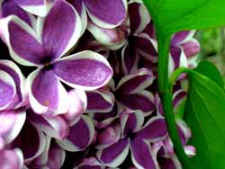

# Lilac

*From Wikipedia, the free encyclopedia.*

**Lilac** \(**Syringa**\) is a [genus](glossaryGenus.md) of about 20–25 species of flowering plants in the olive family \(**Oleaceae**\), native to Europe and Asia.

They are deciduous shrubs or small trees, ranging in size from 2–10 m tall, with stems up to 20–30 cm diameter. The leaves are opposite \(occasionally in whorls of three\) in arrangement, and their shape is simple and heart-shaped to broad lanceolate in most species, but pinnate in a few species \(e.g. **S. protolaciniata**, **S. pinnatifolia**\). The flowers are produced in spring, each flower being 5–10 mm in diameter with a four-lobed corolla, the corolla tube narrow, 5–20 mm long. The usual flower colour is a shade of purple \(often a light purple or lilac\), but white and pale pink are also found. The flowers grow in large [panicle](glossaryPanicle.md), and in several species have a strong fragrance. Flowering varies between mid spring to early summer, depending on the species. The fruit is a dry, brown capsule, splitting in two at maturity to release the two winged seeds.

**Lilacs** are popular shrubs in parks and gardens throughout the temperate zone. In addition to the species listed above, several hybrids and numerous [cultivars](glossaryCultivar.md) have been developed. The term **French lilac** is often used to refer to modern double-flowered cultivars, thanks to the work of prolific breeder Victor Lemoine.

**Lilacs** flower on old wood, and produce more flowers if unpruned. If pruned, the plant responds by producing fast-growing young vegetative growth with no flowers, in an attempt to restore the removed branches; a pruned lilac often produces few or no flowers for one to five or more years, before the new growth matures sufficiently to start flowering. Unpruned lilacs flower reliably every year. Despite this, a common fallacy holds that lilacs should be pruned regularly. If pruning is required, it should be done right after flowering is finished, before next year's flower buds are formed. Lilacs generally grow better in slightly alkaline soil. The wood of lilac is close-grained, diffuse-porous, extremely hard and one of the densest in Europe. The sapwood is typically cream-coloured and the heartwood has various shades of brown and purple. Lilac wood has traditionally been used for engraving, musical instruments, knife handles etc. When drying, the wood has a tendency to be encurved as a twisted material, and to split into narrow sticks.

**Related information**  

[Gardenia](gardenia.md#)

