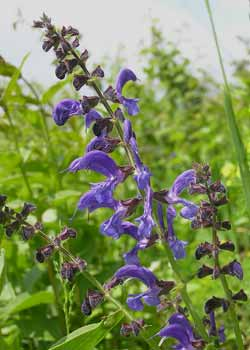

# Salvia

*From Wikipedia, the free encyclopedia.*

**Salvia** is the largest [genus](glossaryGenus.md) of plants in the mint family, **Lamiaceae**, with approximately 900 species of shrubs, herbaceous perennials, and annuals. It is one of three genera commonly referred to as sage. When used without modifiers, sage generally refers to **Salvia officinalis** \("common sage"\); however, it can be used with modifiers to refer to any member of the genus. The ornamental species are commonly referred to by their scientific name **Salvia**. The genus is distributed throughout the world, with the center of diversity and origin appearing to be Central and South Western Asia, while nearly 500 species are native to Mexico and Central and South America.

The name is derived from the Latin *salvere* \("to save"\), referring to the long-believed healing properties of salvia. The Latin was corrupted to '*sauja*', to the French '*sauge*', and to the old English '*sawge*', and eventually became the modern day '*sage*'. Pliny the Elder was the first to use the Latin name salvia.

**Salvia** species include annual, biennial, or perennial herbs, along with woody based sub-shrubs. The stems are typically angled like other members in **Lamiaceae**. The flowers are produced in spikes, racemes, or panicles, and generally produce a showy display with flower colors ranging from blue to red, with white and yellow less common. The calyx is normally tubular or bell shaped, without bearded throats, and divided into two parts or lips, the upper lip entire or three-toothed, the lower two-cleft. The corollas are often claw shaped and are two-lipped with the upper lip entire or notched and spreading. The lower lip typically has three lobes with the middle lobe longest. The stamens are reduced to two short structures with anthers two-celled, the upper cell fertile, and the lower imperfect. The flower styles are two-cleft. The fruits are smooth nutlets and many species have a mucilaginous coating. Salvia species are used as food plants by the larvae of some **Lepidoptera** \(butterfly and moth\) species including the bucculatricid leaf-miner **Bucculatrix taeniola** which feeds exclusively on the genus and the **Coleophora** case-bearers **C. aegyptiacae**, **C. salviella** \(both feed exclusively on **S. aegyptiaca**\), **C. ornatipennella** and **C. virgatella** \(both recorded on **S. pratensis**\).

The defining characteristic of the genus **Salvia** is the unusual [pollination](glossaryPollination.md) mechanism, which consists of two stamens \(instead of the typical four found in other members of the tribe **Mentheae**\) and the way the two stamens are connected to form a lever. When a pollinator enters the flower for nectar, the lever activates causing the stamens to move and the pollen to be deposited on the pollinator. When the pollinator withdraws from the flower, the lever returns the stamens to their original position. As the pollinator enters another flower of the same species, the stigma is placed in a general location that corresponds to where the pollen was deposited on the pollinator's body. It is believed that this is a key factor in the speciation of this large group of diverse plants. However, it now appears that somewhat different versions of this lever mechanism have evolved in the tribe Mentheae, and that **Salvia** is not monophyletic.

**Related information**  

[Chrysanthemum](chrysanthemum.md#)

